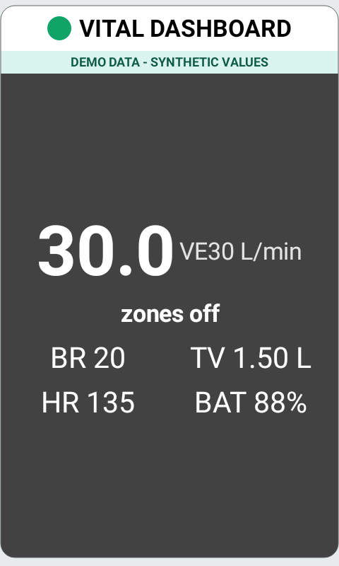
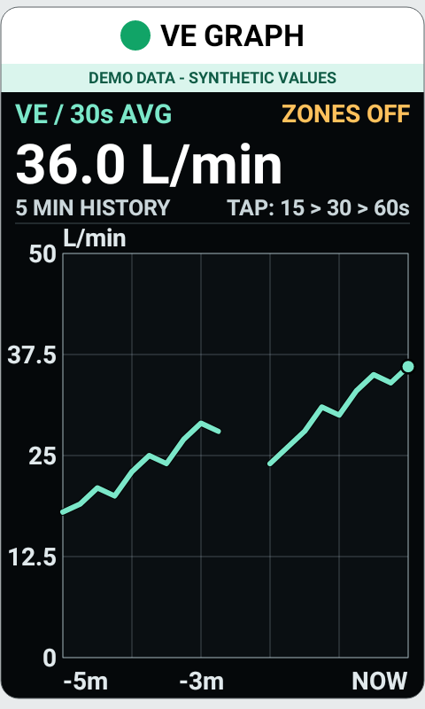

# VitalBreathe

VitalBreathe brings live Tymewear VitalPro breathing data to a Hammerhead Karoo. It shows a ride-ready dashboard and five-minute ventilation graph, and saves breathing data into the ride's FIT file.

[](https://github.com/misb74/vitalbreathe-karoo/actions/workflows/android.yml)
[](https://github.com/misb74/vitalbreathe-karoo/releases/latest)
[](LICENSE)
[](PRIVACY.md)

VitalBreathe is an unofficial open-source community project. It is not produced, supported, or endorsed by Tymewear or Hammerhead. Treat its readings as training information, not medical advice.

VitalBreathe itself has no Internet permission. It connects directly to the VitalPro and stores its settings on the Karoo. Breathing data added to a ride can still leave the device when Karoo syncs that FIT activity through services you have enabled. See [Privacy](PRIVACY.md).

<p align="center">
  
  
</p>

<p align="center"><em>Privacy-safe interface previews using synthetic demonstration values.</em></p>

## Install the public beta

Version **1.0.0-beta.1** (code 10007) is intended for:

- the latest-generation Karoo, commonly called Karoo 3 or K24;
- a Tymewear VitalPro breathing sensor; and
- Karoo software version 1.613.2351 or later.

Karoo 2 can only use the ADB route described below and has not been validated for this beta.

### Karoo 3: install with Companion

1. Open the [VitalBreathe 1.0.0-beta.1 release](https://github.com/misb74/vitalbreathe-karoo/releases/tag/v1.0.0-beta.1) on your phone.
2. Download `vitalbreathe-karoo-1.0.0-beta.1.apk` and its `.sha256` checksum file.
3. Share the APK file to the Hammerhead Companion app. Follow Hammerhead's official [Companion sideloading guide](https://support.hammerhead.io/hc/en-us/articles/31576497036827-Companion-App-Sideloading) if this is your first sideload.
4. Wait for Companion and the Karoo to confirm that installation has finished.
5. Open **VitalBreathe** from the Karoo app list once and allow sensor access.

The release notes publish both the APK checksum and its long-lived signing-certificate fingerprint. On macOS, verify a downloaded APK with:

```bash
shasum -a 256 -c vitalbreathe-karoo-1.0.0-beta.1.apk.sha256
```

On Linux, use `sha256sum -c` with the same checksum file.

If you already have the signed `1.0.0-personal.6` test build, this beta can upgrade it without clearing settings because the package and signer are unchanged. Android cannot upgrade a debug-signed copy with a release-signed copy. If Android reports a conflicting signature, see [Installation problems](SUPPORT.md#installation-problems) before uninstalling anything; uninstalling clears VitalBreathe settings and its Karoo sensor pairing.

To update later, repeat the Companion steps with the newer signed APK and install it over the existing app. Do not uninstall first. Check that the signing-certificate fingerprint in the new release still matches the public release line.

### Karoo 2 or USB installation

USB installation is for experienced users. Enable USB debugging, connect exactly one authorised Karoo, then run from this repository:

```bash
./scripts/karoo-adb.sh devices -l
./scripts/karoo-adb.sh install -r /absolute/path/to/vitalbreathe-karoo-1.0.0-beta.1.apk
```

## Pair the VitalPro

1. Open VitalBreathe on the Karoo and allow Bluetooth sensor access. Android 11 and earlier may also request location permission because those Android versions tie Bluetooth discovery to that permission; VitalBreathe does not read GPS location.
2. The optional **Sensor ID** is the four characters after `TYME-` when your strap advertises that name. Enter exactly four characters from `0-9` or `A-F`, or leave it blank.
3. Leave all five ventilation thresholds blank for now unless you have your own sport-specific Tymewear threshold-test results. Leave all four Mobilization Index values blank unless you intend to test that experimental feature. Tap **Save Settings**.
4. Wear the VitalPro to wake it. Disconnect the official Tymewear phone app and any other device using the breathing connection.
5. On the Karoo, open **Settings → Sensors → Add Sensor → Extensions**. Choose the puzzle-piece Extensions entry, then select the strap shown as `TYME-XXXX` or a VitalPro name.
6. Return to VitalBreathe. **Connected** should appear, followed by the strap battery when the sensor provides it. Live values begin after completed breaths arrive.

Pair through **Sensors → Extensions**. Adding a data field to a profile does not pair the strap, and the Karoo's generic Bluetooth settings are not the correct route.

If K-Breathe is also installed, disable or unpair its VitalPro sensor. Two extensions competing for the same strap can prevent either one from receiving data.

## Set up ride pages

Open **Profiles → your activity profile → Data Pages**. A practical setup is:

- **Page 1:** Speed plus **Vital Dashboard** for normal riding.
- **Page 2:** **VE Graph** as the only field, giving the graph the full page.
- **Page 3:** **VE Zones** if you use personal ventilation thresholds.

Swipe between those pages during a ride. The graph is a separate field and never replaces the dashboard automatically.

## Understand the ride screens

| Field | What it shows |
| --- | --- |
| **Vital Dashboard** | VE30, ventilation zone, breathing rate, tidal volume, Karoo heart rate, and VitalPro battery in one view |
| **VE** | Minute ventilation in L/min; tap to cycle live, 5s, 15s, 30s, and 60s averaging |
| **VE Graph** | Five minutes of VE history with time and L/min scales; tap to cycle 15s, 30s, and 60s averaging |
| **BR** | Smoothed breathing rate in breaths per minute |
| **TV** | Smoothed tidal volume in litres per breath |
| **VitalPro Battery** | Battery percentage reported by the sensor, or `—` when unavailable |
| **VE Zones** | Live zone-time distribution outside a recording and recorded distribution during a ride |
| **MI % / MI Reserve** | Experimental personal metrics requiring four personal settings and a usable Karoo heart-rate source |

VE30 is the default stable ventilation signal. It drives the dashboard colour, VE zone, zone timer, and recorded FIT zone.

The graph begins filling after the first valid breath. **ZONES OFF** is normal when thresholds are blank; the graph still shows an automatically scaled trace. A gap in the line represents missing sensor data. VitalBreathe deliberately does not draw a false connection across a dropout. Tap anywhere on the graph to change its current 15s, 30s, or 60s smoothing mode.

## Optional personal zones

You can use every breathing field without enabling zones. To enable zone colours, copy all five VE values for the correct sport from your latest Tymewear threshold test:

| Zone | Range |
| --- | --- |
| **Z1** | Below Endurance |
| **Z2** | Endurance to VT1 |
| **Z3** | VT1 to VT2 |
| **Z4** | VT2 to Top Z4 |
| **Z5** | Top Z4 and above |

VO2max is the graph's upper reference, not a sixth boundary. Values must be positive and ordered as **Endurance < VT1 < VT2 < Top Z4 < VO2max**. Use all five values or leave all five blank. Never use another rider's values.

Settings saved during a recording take effect after that ride, keeping one consistent zone definition throughout the FIT file. Tymewear's [threshold settings guide](https://www.tymewear.com/blogs/connectivity/setting-threshold-values) explains where these personal values come from.

## What is saved in the FIT file

During a recorded ride, VitalBreathe adds fresh breathing records at roughly one-second intervals. They include breathing rate, tidal volume, raw completed-breath VE, VE30, inhale/exhale ratio, and the current VE zone. The five zone thresholds used for the ride are stored with the session. Experimental MI fields appear only when their personal inputs are valid.

VitalBreathe stops writing breath records when data becomes stale. It does not fill sensor gaps with zeroes or repeat an old breath indefinitely.

These are FIT developer fields. Hammerhead, Strava, and other services may preserve them without displaying them. Support varies by service. VitalBreathe does not sign in to Tymewear and does not upload a ride to the Tymewear cloud. You can download the original file from Hammerhead Dashboard using **Rides → … → Download FIT** and Hammerhead's [FIT download guide](https://support.hammerhead.io/hc/en-us/articles/360003096654-Dashboard-Downloading-a-FIT-file).

The exact field schema is documented in [FIT and BLE protocol notes](docs/PROTOCOL.md).

## What has been tested

The previous signed test build was exercised on a latest-generation Karoo identified as K24 with a VitalPro. The dashboard and graph were physically checked. Two controlled connection losses recovered in about 11 and 13 seconds without restarting the app. After the FIT metadata-order fix, strict decoding found every custom field described before use; 65 populated breathing records contained no zero, partial, or stale core readings.

That is useful evidence, but it is not an endurance programme. Configured zones, experimental MI, third-party FIT imports, 20 consecutive rides, a four-hour ride, and Karoo 2 remain unproven. Beta.1 also needs its own final hardware confirmation. See the honest [validation record](docs/VALIDATION.md).

## Troubleshooting and support

If the strap is missing or values stay blank, first wear it, close the official phone app, disable K-Breathe, and check that the Karoo paired it under **Sensors → Extensions**. The VitalBreathe app shows its build, Bluetooth phase, retry count, last completed-breath age, and last connection issue.

The [support guide](SUPPORT.md) covers installation signatures, permissions, pairing, blank graphs, zones, FIT files, and safe diagnostic capture. Support is community best-effort. Do not post an unredacted diagnostic capture or FIT file in a public issue; they can contain Bluetooth identifiers, health information, and route data.

## Feature scope

| Capability | VitalBreathe beta |
| --- | --- |
| Direct VitalPro connection and automatic retry | Included |
| Combined ride dashboard | Included |
| Five-minute VE graph and honest dropout gaps | Included |
| Manual personal five-zone model | Included, still awaiting configured-zone hardware validation |
| Fresh breathing data in Karoo FIT files | Included |
| Automatic Tymewear sign-in, threshold import, or cloud upload | Not included; no supported public API is documented |
| Tymewear threshold test | Not included; use the official Tymewear service |
| Dedicated lap-average ventilation | Not included |

The sourced [Garmin comparison](docs/GARMIN_COMPARISON.md) explains the deliberate differences in more detail.

## Develop or contribute

Developers should start with [Contributing](CONTRIBUTING.md). Hardware changes use the privacy-safe workflow in [Validation](docs/VALIDATION.md) and the reusable [hardware test record](docs/HARDWARE_TEST_TEMPLATE.md). Release history is in the [Changelog](CHANGELOG.md).

Community participation follows the [Code of Conduct](CODE_OF_CONDUCT.md). Security reports use the private process in [Security](SECURITY.md).

VitalBreathe is based on [K-Breathe](https://github.com/gloscherrybomb/k-breathe). Its application code remains under the [MIT licence](LICENSE). The vendored Hammerhead karoo-ext 1.1.8 source remains under Apache License 2.0; its exact provenance is recorded in [`karoo-ext/UPSTREAM.md`](karoo-ext/UPSTREAM.md). All bundled attribution is collected in [Third-party notices](THIRD_PARTY_NOTICES.md).
